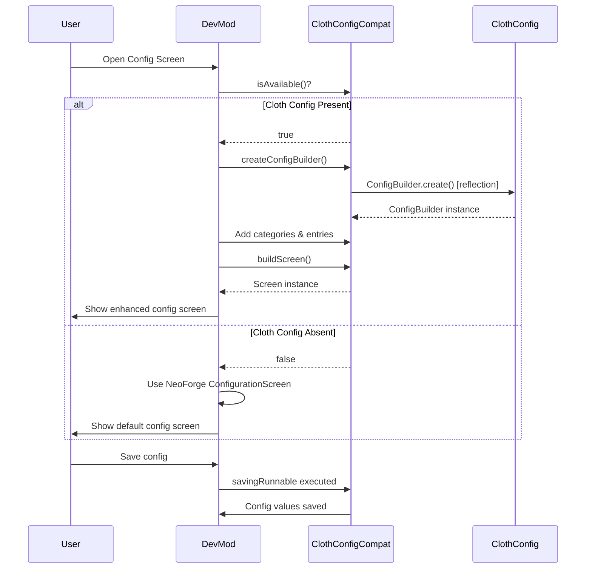

# Cloth Config API Integration

## 1. Mod Overview

| Property | Value |
|----------|-------|
| **Mod Name** | Cloth Config API |
| **Mod ID** | `cloth_config` |
| **Version Detected** | 15.0.140 |
| **Minecraft Version** | 1.21.1 |
| **Loader** | NeoForge |
| **Repository** | [GitHub - shedaniel/cloth-config](https://github.com/shedaniel/cloth-config) |
| **Documentation** | [GitBook - Cloth Config](https://shedaniel.gitbook.io/cloth-config/) |
| **Modrinth** | [cloth-config](https://modrinth.com/mod/cloth-config) |
| **CurseForge** | [cloth-config](https://www.curseforge.com/minecraft/mc-mods/cloth-config) |

## 2. Compatibility Goals

### Problems Solved
- Provides a unified, user-friendly config screen API
- Eliminates need for manual `.toml`/`.json` config file editing
- Offers rich UI components (sliders, toggles, dropdowns, color pickers)
- Supports categories and sub-categories for organized settings

### Improvements for DevMod
- Enhanced config screens when Cloth Config is present
- More intuitive user experience for adjusting DevMod settings
- Validation callbacks for config values
- Automatic save/load handling

## 3. Detection & Gating

### Detection Method
```java
// Using DevMod's Compat utility
boolean isLoaded = Compat.isLoaded("cloth_config");

// Or check for specific classes
boolean hasApi = Compat.classExists("me.shedaniel.clothconfig2.api.ConfigBuilder");
```

### Avoiding Classloading Issues
- All Cloth Config classes accessed via **reflection only**
- No direct imports of `me.shedaniel.clothconfig2.*` in common code
- Cached Method/Class references for performance
- Graceful fallback to NeoForge's default ConfigurationScreen

### Gating Pattern
```java
if (ClothConfigCompat.isAvailable()) {
    // Use Cloth Config for enhanced screen
    Object screen = ClothConfigCompat.createConfigBuilder();
    // ... configure and build
} else {
    // Fall back to default NeoForge config screen
    minecraft.setScreen(new ConfigurationScreen(container, parent));
}
```

## 4. Integration Design

### API Used
- `me.shedaniel.clothconfig2.api.ConfigBuilder` - Main builder class
- `me.shedaniel.clothconfig2.api.ConfigCategory` - Category container
- `me.shedaniel.clothconfig2.api.ConfigEntryBuilder` - Entry creation
- `me.shedaniel.clothconfig2.api.AbstractConfigListEntry` - Entry base

### Hook Points
1. Config screen creation (client-side only)
2. Category organization
3. Entry builders (toggles, sliders, etc.)
4. Save callbacks

### Flow Diagram



## 5. Implemented Changes

### Files Modified
| File | Change |
|------|--------|
| `ModIntegrationManager.java` | Added ClothConfigCompat registration |
| `Compat.java` | Added `CLOTH_CONFIG` constant |

### New Files Created
| File | Purpose |
|------|---------|
| `com.devmod.compat.mods.clothconfig.ClothConfigCompat` | Main compat module |

### ClothConfigCompat Features
- `isAvailable()` - Check if Cloth Config is present
- `createConfigBuilder()` - Create builder via reflection
- `getEntryBuilder()` - Get entry builder from config builder
- `setTitle()` - Set screen title
- `getOrCreateCategory()` - Category management
- `addBooleanToggle()` - Add boolean toggle entry
- `addIntSlider()` - Add integer slider entry
- `buildScreen()` - Build final screen
- `setParentScreen()` - Set parent for back navigation
- `setSavingRunnable()` - Set save callback

## 6. New Features When Present

| Feature | Description |
|---------|-------------|
| **Enhanced Config UI** | Visual sliders, toggles instead of text fields |
| **Organized Categories** | Settings grouped into logical categories |
| **Live Validation** | Immediate feedback on invalid values |
| **Tooltips** | Descriptive tooltips for each setting |
| **Reset to Default** | Per-entry reset buttons |

### Usage Example
```java
// When Cloth Config is present, DevMod config screens will use:
// - Sliders for numeric values (damage multipliers, cooldowns)
// - Toggles for boolean settings (enable/disable features)
// - Dropdowns for enum selections (display modes)
// - Color pickers for color settings (HUD colors)
```

## 7. Risks & Edge Cases

| Risk | Mitigation |
|------|------------|
| API changes between versions | Version check + reflection fallback |
| NoSuchMethodException | Catch and log, fall back to default |
| ClassNotFoundException | Graceful detection in `initCommon()` |
| Client/Server mismatch | Only used on client side |

### Known Limitations
- Reflection overhead (minimal, cached)
- Some advanced Cloth Config features not exposed
- Auto-config annotation system not integrated (manual API only)

## 8. How to Test

### Manual Testing Steps
1. Launch game with Cloth Config installed
2. Check logs for: `[Compat:cloth_config] Cloth Config API detected and available`
3. Open DevMod config screen (Mods menu > DevMod > Config)
4. Verify enhanced UI elements (sliders, toggles)
5. Change a setting and save
6. Restart game and verify setting persisted

### Without Cloth Config
1. Remove Cloth Config from mods folder
2. Launch game
3. Check logs for: `[Compat:cloth_config] Cloth Config classes not found - using fallback`
4. Open DevMod config screen
5. Verify default NeoForge config screen appears
6. Verify no crashes or errors

### Expected Log Output
```
[Compat:cloth_config] Cloth Config API detected and available
[Compat:cloth_config] Version: 15.0.140
[Compat:cloth_config] Client initialization complete
```

### Smoke Test
```java
// Automated check (can be added to DevModGameTests)
@Test
void clothConfigCompat_detectsPresence() {
    boolean expected = ModList.get().isLoaded("cloth_config");
    assertEquals(expected, ClothConfigCompat.isAvailable());
}
```

## 9. Changelog

| Date | Commit | Changes |
|------|--------|---------|
| 2024-12-24 | Initial | Created ClothConfigCompat module |
| | | Added reflection-based API access |
| | | Documented integration pattern |
