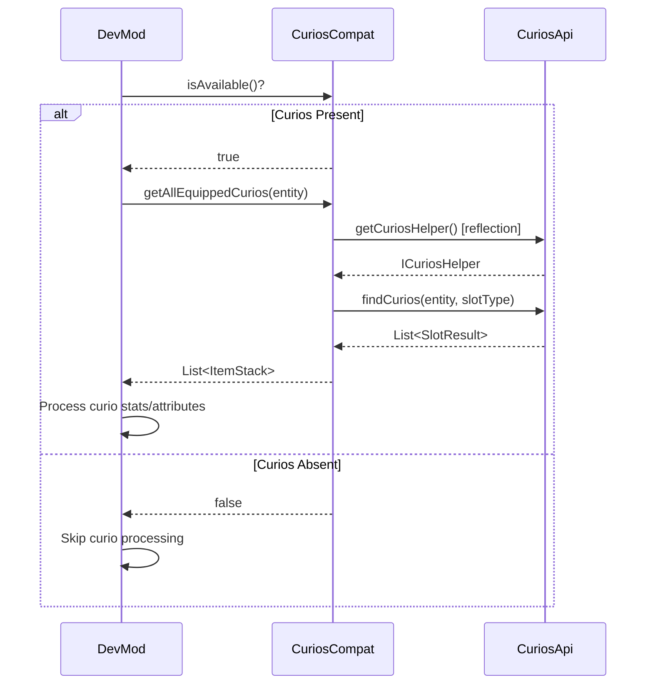

# Curios API Integration

## 1. Mod Overview

| Property | Value |
|----------|-------|
| **Mod Name** | Curios API |
| **Mod ID** | `curios` |
| **Version Detected** | 9.5.1+1.21.1 |
| **Minecraft Version** | 1.21.1 |
| **Loader** | NeoForge |
| **Repository** | [GitHub - TheIllusiveC4/Curios](https://github.com/TheIllusiveC4/Curios) |
| **CurseForge** | [curios](https://www.curseforge.com/minecraft/mc-mods/curios) |
| **Modrinth** | [curios](https://modrinth.com/mod/curios) |

## 2. Compatibility Goals

### Problems Solved
- Provides extra equipment slots beyond vanilla armor
- Flexible slot type system (rings, necklaces, belts, etc.)
- Standard API for accessory mods to use
- Attribute system for curio items

### Improvements for DevMod
- Detect equipped curios for accurate damage/stat calculations
- Show curio attributes in entity info overlays
- Support curio items in the item editor
- Include curio stats in telemetry data
- Display curio equipment in HUD when relevant

## 3. Detection & Gating

### Detection Method
```java
// Using DevMod's Compat utility
boolean isLoaded = Compat.isLoaded("curios");

// Or check via CuriosCompat
boolean available = CuriosCompat.isAvailable();
```

### Avoiding Classloading Issues
- All Curios API classes accessed via **reflection only**
- No direct imports of `top.theillusivec4.curios.*`
- Cached Method/Class references for performance
- Safe fallback when Curios is not present

### Gating Pattern
```java
if (CuriosCompat.isAvailable()) {
    // Get all equipped curios
    List<ItemStack> curios = CuriosCompat.getAllEquippedCurios(entity);

    // Check specific slots
    if (CuriosCompat.hasRingEquipped(player)) {
        // Apply ring bonuses
    }
} else {
    // Curios not present - skip curio checks
}
```

## 4. Integration Design

### API Used
- `top.theillusivec4.curios.api.CuriosApi` - Main API entry point
- `top.theillusivec4.curios.api.type.util.ICuriosHelper` - Helper interface
- `top.theillusivec4.curios.api.SlotResult` - Slot query results

### Slot Types Supported
| Constant | Slot Type | Description |
|----------|-----------|-------------|
| `SLOT_HEAD` | `head` | Head accessories |
| `SLOT_NECKLACE` | `necklace` | Necklaces, amulets |
| `SLOT_BACK` | `back` | Capes, backpacks |
| `SLOT_BODY` | `body` | Body accessories |
| `SLOT_HANDS` | `hands` | Gloves, gauntlets |
| `SLOT_RING` | `ring` | Rings |
| `SLOT_BELT` | `belt` | Belts |
| `SLOT_CHARM` | `charm` | Charms, trinkets |
| `SLOT_CURIO` | `curio` | Generic slot |

### Flow Diagram



## 5. Implemented Changes

### Files Modified
| File | Change |
|------|--------|
| `ModIntegrationManager.java` | Added CuriosCompat registration |
| `Compat.java` | Added `CURIOS` constant |

### New Files Created
| File | Purpose |
|------|---------|
| `com.devmod.compat.mods.curios.CuriosCompat` | Main compat module |

### CuriosCompat Features
- `isAvailable()` - Check if Curios is present
- `findCurios(entity, slotType)` - Find all curios in a slot type
- `findFirstCurio(entity, slotType)` - Find first curio in slot
- `getStackFromResult(slotResult)` - Extract ItemStack from result
- `getAllEquippedCurios(entity)` - Get all equipped curios
- `hasCurioEquipped(entity, slotType)` - Check if slot has curio
- `getCurioCount(entity, slotType)` - Count curios in slot
- `hasRingEquipped(player)` - Convenience: check for rings
- `hasNecklaceEquipped(player)` - Convenience: check for necklace
- `getEquippedRings(player)` - Get all equipped rings
- `getEquippedNecklace(player)` - Get first necklace

## 6. New Features When Present

| Feature | Description |
|---------|-------------|
| **Curio Stats in HUD** | Display curio attributes in entity info overlay |
| **Damage Calculation** | Include curio modifiers in damage calculations |
| **Item Editor Support** | Recognize and edit curio items |
| **Telemetry Data** | Track curio usage in combat analytics |
| **Equipment Display** | Show full equipment including curios |

### Usage Examples

```java
// In damage calculation
if (CuriosCompat.isAvailable()) {
    for (ItemStack curio : CuriosCompat.getAllEquippedCurios(target)) {
        // Apply curio damage modifiers
        damageMultiplier += getCurioBonus(curio);
    }
}

// In entity info overlay
if (CuriosCompat.isAvailable()) {
    int ringCount = CuriosCompat.getCurioCount(entity, CuriosCompat.SLOT_RING);
    if (ringCount > 0) {
        // Display ring info in HUD
    }
}
```

## 7. Risks & Edge Cases

| Risk | Mitigation |
|------|------------|
| API changes between versions | Version check + reflection fallback |
| NoSuchMethodException | Catch and log, return empty results |
| Slot types not present | Graceful empty list return |
| Performance with many curios | Lazy evaluation, caching |

### Known Limitations
- Only reads curio data, doesn't modify slots
- Some modded slot types may not be covered by constants
- Advanced curio attributes require additional reflection

## 8. How to Test

### Manual Testing Steps
1. Launch game with Curios installed
2. Check logs for: `[Compat:curios] Curios API detected and available`
3. Equip a ring or necklace (from any Curios-compatible mod)
4. Open DevMod entity info overlay
5. Verify curio items are displayed
6. Check damage calculation includes curio modifiers

### Without Curios
1. Remove Curios from mods folder
2. Launch game
3. Check logs for: `[Compat:curios] Curios classes not found - integration disabled`
4. Verify no crashes or errors
5. Verify DevMod works normally without curio features

### Expected Log Output
```
[Compat:curios] Curios API detected and available
[Compat:curios] Version: 9.5.1+1.21.1
[Compat:curios] Client initialization complete
```

### Smoke Test
```java
@Test
void curiosCompat_detectsPresence() {
    boolean expected = ModList.get().isLoaded("curios");
    assertEquals(expected, CuriosCompat.isAvailable());
}

@Test
void curiosCompat_returnsEmptyWhenNotLoaded() {
    if (!CuriosCompat.isAvailable()) {
        assertTrue(CuriosCompat.getAllEquippedCurios(player).isEmpty());
    }
}
```

## 9. Changelog

| Date | Commit | Changes |
|------|--------|---------|
| 2024-12-24 | Initial | Created CuriosCompat module |
| | | Added slot type constants |
| | | Implemented curio detection methods |
| | | Documented integration pattern |
