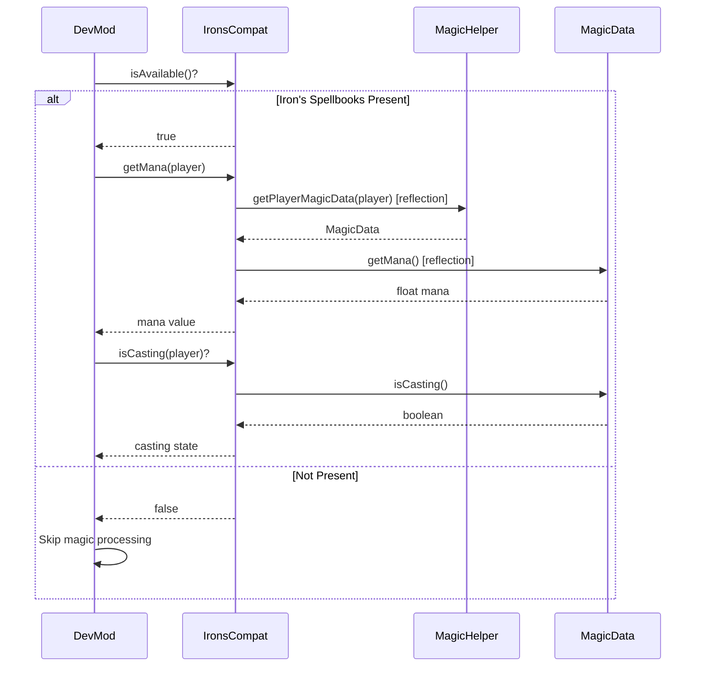

# Iron's Spells 'n Spellbooks Integration

## 1. Mod Overview

| Property | Value |
|----------|-------|
| **Mod Name** | Iron's Spells 'n Spellbooks |
| **Mod ID** | `irons_spellbooks` |
| **Version Detected** | 3.14.4 |
| **Minecraft Version** | 1.21.1 |
| **Loader** | NeoForge |
| **Repository** | [GitHub - iron431/irons-spells-n-spellbooks](https://github.com/iron431/irons-spells-n-spellbooks) |
| **Documentation** | [iron.wiki/developers](https://iron.wiki/developers/) |
| **CurseForge** | [irons-spells-n-spellbooks](https://www.curseforge.com/minecraft/mc-mods/irons-spells-n-spellbooks) |
| **Modrinth** | [irons-spells-n-spellbooks](https://modrinth.com/mod/irons-spells-n-spellbooks) |

## 2. Compatibility Goals

### Problems Solved
- Provides complete magic system with mana management
- Adds spell casting with cooldowns and levels
- Multiple schools of magic with unique effects
- Magic equipment, artifacts, and spellbooks

### Improvements for DevMod
- Track player mana in HUD displays
- Include spell damage in damage calculations
- Monitor spell casting events in telemetry
- Display magic stats in entity info overlays
- Support spell items in the item editor
- Track spell usage in combat analytics

## 3. Detection & Gating

### Detection Method
```java
// Using DevMod's Compat utility
boolean isLoaded = Compat.isLoaded("irons_spellbooks");

// Or check via IronsSpellbooksCompat
boolean available = IronsSpellbooksCompat.isAvailable();
```

### Avoiding Classloading Issues
- All API classes accessed via **reflection only**
- No direct imports of `io.redspace.ironsspellbooks.*`
- Cached Method/Class references for performance
- Safe fallback when mod is not present

### Gating Pattern
```java
if (IronsSpellbooksCompat.isAvailable()) {
    // Get player mana
    float mana = IronsSpellbooksCompat.getMana(player);
    float maxMana = IronsSpellbooksCompat.getMaxMana(player);

    // Check if casting
    if (IronsSpellbooksCompat.isCasting(player)) {
        String spellName = IronsSpellbooksCompat.getCastingSpellName(player);
        // Track spell casting...
    }
} else {
    // Magic system not available
}
```

## 4. Integration Design

### API Used
- `io.redspace.ironsspellbooks.api.magic.MagicData` - Player magic state
- `io.redspace.ironsspellbooks.api.magic.MagicHelper` - Helper methods
- `io.redspace.ironsspellbooks.api.spells.AbstractSpell` - Spell base class

### Schools of Magic
| Constant | School | Description |
|----------|--------|-------------|
| `SCHOOL_FIRE` | Fire | Fire-based damage spells |
| `SCHOOL_ICE` | Ice | Freezing and cold effects |
| `SCHOOL_LIGHTNING` | Lightning | Electric damage |
| `SCHOOL_HOLY` | Holy | Healing and light magic |
| `SCHOOL_ENDER` | Ender | Teleportation, void |
| `SCHOOL_BLOOD` | Blood | Life-steal, blood magic |
| `SCHOOL_EVOCATION` | Evocation | Summoning, force |
| `SCHOOL_NATURE` | Nature | Plants, animals |
| `SCHOOL_ELDRITCH` | Eldritch | Dark, cosmic horror |

### Flow Diagram



## 5. Implemented Changes

### Files Modified
| File | Change |
|------|--------|
| `ModIntegrationManager.java` | Added IronsSpellbooksCompat registration |
| `Compat.java` | Added `IRONS_SPELLBOOKS` constant |

### New Files Created
| File | Purpose |
|------|---------|
| `com.devmod.compat.mods.ironsspellbooks.IronsSpellbooksCompat` | Main compat module |

### IronsSpellbooksCompat Features
- `isAvailable()` - Check if mod is present
- `getMagicData(player)` - Get raw MagicData object
- `getMana(player)` - Get current mana
- `getMaxMana(player)` - Get maximum mana
- `getManaPercentage(player)` - Get mana as 0.0-1.0
- `isCasting(player)` - Check if player is casting
- `getCastingSpell(player)` - Get current spell
- `getCastingSpellName(player)` - Get spell name
- `hasMagicData(entity)` - Check if entity has magic
- `getMagicStatusString(player)` - Get status for display
- `isApiFullyFunctional()` - Verify API works

## 6. New Features When Present

| Feature | Description |
|---------|-------------|
| **Mana HUD Display** | Show current/max mana in player HUD |
| **Casting Indicator** | Display when player is casting a spell |
| **Spell Damage Tracking** | Include spell damage in telemetry |
| **Magic Stats Overlay** | Show magic stats in entity info |
| **Combat Analytics** | Track spell usage patterns |

### Usage Examples

```java
// In HUD overlay
if (IronsSpellbooksCompat.isAvailable()) {
    float manaPercent = IronsSpellbooksCompat.getManaPercentage(player);
    if (manaPercent >= 0) {
        // Render mana bar at manaPercent
        renderManaBar(manaPercent);
    }

    if (IronsSpellbooksCompat.isCasting(player)) {
        String spell = IronsSpellbooksCompat.getCastingSpellName(player);
        renderCastingIndicator(spell);
    }
}

// In telemetry
if (IronsSpellbooksCompat.isAvailable()) {
    String status = IronsSpellbooksCompat.getMagicStatusString(player);
    telemetry.recordMagicState(status);
}
```

## 7. Risks & Edge Cases

| Risk | Mitigation |
|------|------------|
| API changes between versions | Version check + reflection fallback |
| NoSuchMethodException | Catch and return safe defaults |
| MagicData not present | Null checks, return -1/false |
| Different API in older versions | Try multiple class locations |

### Known Limitations
- Only reads magic data, doesn't modify it
- Some spell details require additional reflection
- Mana regen rate not yet exposed
- School-specific effects not tracked

## 8. How to Test

### Manual Testing Steps
1. Launch game with Iron's Spellbooks installed
2. Check logs for: `[Compat:irons_spellbooks] Iron's Spellbooks detected and available`
3. Obtain a spellbook and some mana
4. Open DevMod HUD overlay
5. Verify mana is displayed
6. Cast a spell and verify casting indicator appears
7. Check telemetry for spell events

### Without Iron's Spellbooks
1. Remove Iron's Spellbooks from mods folder
2. Launch game
3. Check logs for: `[Compat:irons_spellbooks] Iron's Spellbooks classes not found`
4. Verify no crashes or errors
5. Verify DevMod works normally without magic features

### Expected Log Output
```
[Compat:irons_spellbooks] Iron's Spellbooks detected and available
[Compat:irons_spellbooks] Version: 3.14.4
[Compat:irons_spellbooks] Client initialization complete
```

### Smoke Test
```java
@Test
void ironsSpellbooksCompat_detectsPresence() {
    boolean expected = ModList.get().isLoaded("irons_spellbooks");
    assertEquals(expected, IronsSpellbooksCompat.isAvailable());
}

@Test
void ironsSpellbooksCompat_safeWhenNotLoaded() {
    if (!IronsSpellbooksCompat.isAvailable()) {
        assertEquals(-1f, IronsSpellbooksCompat.getMana(player));
        assertFalse(IronsSpellbooksCompat.isCasting(player));
    }
}
```

## 9. Changelog

| Date | Commit | Changes |
|------|--------|---------|
| 2024-12-24 | Initial | Created IronsSpellbooksCompat module |
| | | Added mana tracking methods |
| | | Added casting detection |
| | | Documented magic schools |
