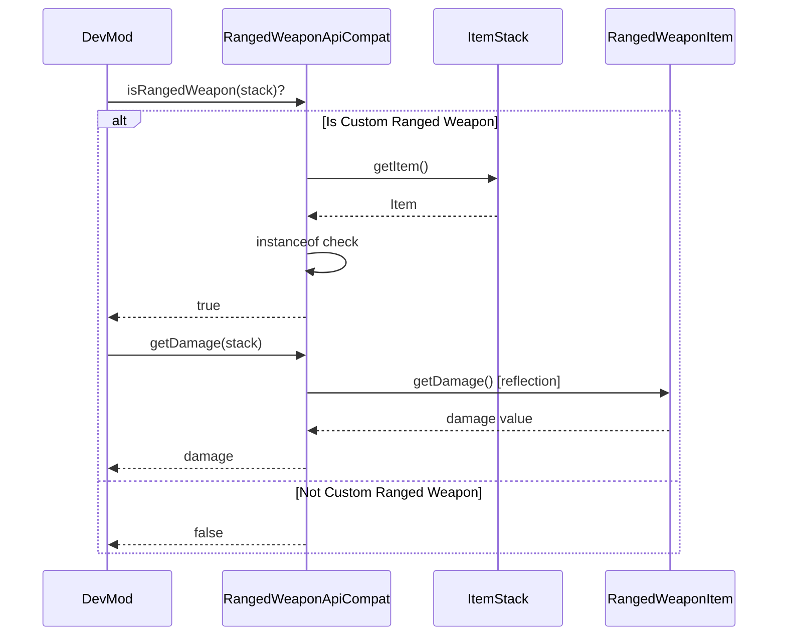

# Ranged Weapon API Integration

## 1. Mod Overview

| Property | Value |
|----------|-------|
| **Mod Name** | Ranged Weapon API |
| **Mod ID** | `ranged_weapon_api` |
| **Version Detected** | 2.3.2+1.21.1 |
| **Minecraft Version** | 1.21.1 |
| **Loader** | NeoForge |
| **Modrinth** | [Ranged Weapon API](https://modrinth.com/mod/ranged-weapon-api) |
| **CurseForge** | [Ranged Weapon API](https://www.curseforge.com/minecraft/mc-mods/ranged-weapon-api) |

## 2. Compatibility Goals

### Problems Solved
- Easy creation of custom bows and crossbows
- Customizable damage, pull time, projectile velocity
- Automatic model predicate registration
- Correct first/third person rendering
- Correct pull FOV calculations

### Improvements for DevMod
- Detect custom ranged weapons
- Read weapon damage/velocity values
- Include ranged stats in damage calculations
- Support ranged weapons in the item editor
- Track ranged weapon usage in telemetry

## 3. Detection & Gating

### Detection Method
```java
// Using DevMod's Compat utility
boolean isLoaded = Compat.isLoaded("ranged_weapon_api");

// Check compat availability
boolean available = RangedWeaponApiCompat.isAvailable();
```

### Avoiding Classloading Issues
- All Ranged Weapon API classes accessed via **reflection only**
- No direct imports of `net.ranged_weapon.*`
- Cached Method/Class references for performance
- Safe fallback when API is not present

### Gating Pattern
```java
if (RangedWeaponApiCompat.isAvailable()) {
    if (RangedWeaponApiCompat.isRangedWeapon(heldItem)) {
        double damage = RangedWeaponApiCompat.getDamage(heldItem);
        // Use damage value for calculations
    }
} else {
    // Ranged Weapon API not present - use vanilla detection
}
```

## 4. Integration Design

### API Used
- `net.ranged_weapon.api.RangedWeaponItem` - Base bow item class
- `net.ranged_weapon.api.CrossbowItem` - Crossbow item class

### Weapon Properties
| Property | Method | Description |
|----------|--------|-------------|
| Damage | `getDamage()` | Base projectile damage |
| Pull Time | `getPullTime()` | Draw time in ticks |
| Velocity | `getVelocity()` | Projectile speed multiplier |

### Flow Diagram



## 5. Implemented Changes

### Files Modified
| File | Change |
|------|--------|
| `ModIntegrationManager.java` | Added RangedWeaponApiCompat registration |

### New Files Created
| File | Purpose |
|------|---------|
| `com.devmod.compat.mods.rangedweaponapi.RangedWeaponApiCompat` | Main compat module |

### RangedWeaponApiCompat Features
- `isAvailable()` - Check if API is loaded
- `isRangedWeapon(stack)` - Check if item is API weapon
- `isCustomCrossbow(stack)` - Check if item is API crossbow
- `getDamage(stack)` - Get base damage
- `getPullTime(stack)` - Get pull time in ticks
- `getVelocity(stack)` - Get velocity multiplier
- `getWeaponStatsSummary(stack)` - Formatted stats string
- `hasPropertyAccess()` - Check if property methods work

## 6. New Features When Present

| Feature | Description |
|---------|-------------|
| **Weapon Detection** | Identify custom ranged weapons |
| **Damage Display** | Show weapon damage in item overlays |
| **Telemetry** | Track ranged weapon usage |
| **Item Editor** | Recognize and display weapon stats |

### Usage Examples

```java
// In damage calculation
if (RangedWeaponApiCompat.isRangedWeapon(weapon)) {
    double baseDamage = RangedWeaponApiCompat.getDamage(weapon);
    if (baseDamage > 0) {
        // Use custom damage value
    }
}

// In item tooltip/overlay
if (RangedWeaponApiCompat.isRangedWeapon(stack)) {
    String stats = RangedWeaponApiCompat.getWeaponStatsSummary(stack);
    // "Damage: 5.0 | Pull: 20t | Velocity: 1.5x"
}

// Check weapon type
if (RangedWeaponApiCompat.isCustomCrossbow(stack)) {
    // Handle crossbow-specific logic
}
```

## 7. Risks & Edge Cases

| Risk | Mitigation |
|------|------------|
| Class path changes | Multiple fallback paths |
| Method signature changes | Reflection with null checks |
| Missing properties | Return -1 for unavailable |
| Performance overhead | Cached class references |

### Known Limitations
- Cannot modify weapon properties (read-only)
- Some weapons may not expose all properties
- Package structure may vary by version
- Crossbow detection requires separate class

## 8. How to Test

### Manual Testing Steps
1. Launch game with Ranged Weapon API installed
2. Check logs for: `[Compat:ranged_weapon_api] Ranged Weapon API detected`
3. Obtain a custom ranged weapon (e.g., from Archers mod)
4. Open DevMod item info overlay
5. Verify weapon stats are displayed
6. Fire the weapon and check damage calculation

### Without Ranged Weapon API
1. Remove Ranged Weapon API from mods folder
2. Launch game
3. Verify no crashes or errors
4. Verify DevMod works with vanilla bows

### Expected Log Output
```
[Compat:ranged_weapon_api] Ranged Weapon API detected
[Compat:ranged_weapon_api] Version: 2.3.2+1.21.1
[Compat:ranged_weapon_api] Client initialization complete
```

## 9. Related Mods

Ranged Weapon API is used by several weapon mods:

| Mod | Usage |
|-----|-------|
| **Archers** | Custom bows and arrows |
| **Arsenal** | Ranged weapons collection |
| **Wizards** | Some magical ranged weapons |

## 10. Changelog

| Date | Commit | Changes |
|------|--------|---------|
| 2024-12-24 | Initial | Created RangedWeaponApiCompat module |
| | | Added weapon detection methods |
| | | Added property query methods |
| | | Documented integration pattern |
