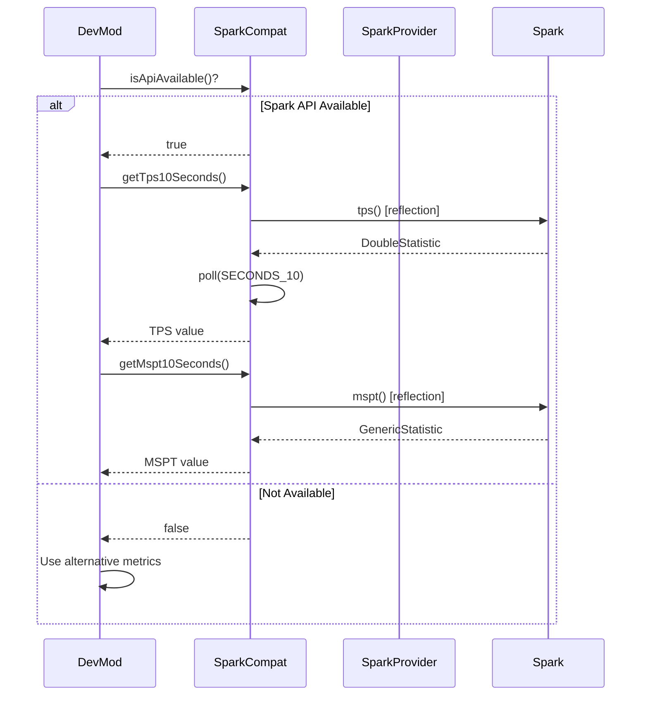

# Spark Profiler Integration

## 1. Mod Overview

| Property | Value |
|----------|-------|
| **Mod Name** | Spark Profiler |
| **Mod ID** | `spark` |
| **Version Detected** | 1.10.124 |
| **Minecraft Version** | 1.21.1 |
| **Loader** | NeoForge |
| **Repository** | [GitHub - lucko/spark](https://github.com/lucko/spark) |
| **Documentation** | [spark.lucko.me](https://spark.lucko.me/docs/) |
| **CurseForge** | [spark](https://www.curseforge.com/minecraft/mc-mods/spark) |
| **Modrinth** | [spark](https://modrinth.com/mod/spark) |

## 2. Compatibility Goals

### Problems Solved
- Provides performance profiling (CPU, memory)
- Monitors TPS (ticks per second) and MSPT (milliseconds per tick)
- Generates health reports
- Tracks GC statistics

### Improvements for DevMod
- Access TPS data for telemetry and analytics
- Monitor MSPT for performance tracking
- Include server health in telemetry reports
- Detect performance issues during arena sessions
- Track performance metrics during combat

## 3. Detection & Gating

### Detection Method
```java
// Using DevMod's Compat utility
boolean isLoaded = Compat.isLoaded("spark");

// Check API availability
boolean apiReady = SparkCompat.isApiAvailable();
```

### Avoiding Classloading Issues
- All Spark API classes accessed via **reflection only**
- No direct imports of `me.lucko.spark.*`
- SparkProvider used to get API instance
- Safe fallback when Spark is not present

### Gating Pattern
```java
if (SparkCompat.isApiAvailable()) {
    double tps = SparkCompat.getTps10Seconds();
    double mspt = SparkCompat.getMspt10Seconds();

    if (tps > 0) {
        telemetry.recordTps(tps);
    }
} else {
    // Spark API not available - use alternative metrics
}
```

## 4. Integration Design

### API Used
- `me.lucko.spark.api.Spark` - Main API interface
- `me.lucko.spark.api.SparkProvider` - API provider
- `me.lucko.spark.api.statistic.StatisticWindow` - Time windows
- `me.lucko.spark.api.statistic.types.DoubleStatistic` - TPS stats
- `me.lucko.spark.api.statistic.types.GenericStatistic` - MSPT stats

### TPS Windows
| Window | Method | Description |
|--------|--------|-------------|
| 10 seconds | `getTps10Seconds()` | Recent TPS average |
| 1 minute | `getTps1Minute()` | Short-term average |
| 5 minutes | `getTps5Minutes()` | Medium-term average |
| 15 minutes | `getTps15Minutes()` | Long-term average |

### MSPT Windows
| Window | Method | Description |
|--------|--------|-------------|
| 10 seconds | `getMspt10Seconds()` | Recent tick time |
| 1 minute | `getMspt1Minute()` | Short-term average |

### Flow Diagram



## 5. Implemented Changes

### Files Modified
| File | Change |
|------|--------|
| `ModIntegrationManager.java` | Added SparkCompat registration |
| `Compat.java` | Added `SPARK` constant |

### New Files Created
| File | Purpose |
|------|---------|
| `com.devmod.compat.mods.spark.SparkCompat` | Main compat module |

### SparkCompat Features
- `isAvailable()` - Check if Spark is loaded
- `isApiAvailable()` - Check if API is ready
- `getTps10Seconds()` - Recent TPS
- `getTps1Minute()` - 1-minute TPS average
- `getTps5Minutes()` - 5-minute TPS average
- `getTps15Minutes()` - 15-minute TPS average
- `getMspt10Seconds()` - Recent MSPT
- `getMspt1Minute()` - 1-minute MSPT average
- `isTpsHealthy()` - Check if TPS >= 19
- `isTpsCritical()` - Check if TPS < 15
- `getTpsStatusString()` - Get formatted status
- `getPerformanceSummary()` - Get TPS + MSPT summary
- `getAllTpsValues()` - Get all TPS values as array

## 6. New Features When Present

| Feature | Description |
|---------|-------------|
| **TPS Telemetry** | Record TPS in telemetry data |
| **MSPT Monitoring** | Track tick times during combat |
| **Performance Alerts** | Warn when TPS drops critically |
| **Arena Health** | Monitor performance during arena sessions |
| **Debug Display** | Show TPS/MSPT in debug overlay |

### Usage Examples

```java
// In telemetry recording
if (SparkCompat.isApiAvailable()) {
    double tps = SparkCompat.getTps10Seconds();
    double mspt = SparkCompat.getMspt10Seconds();

    telemetry.record("server_tps", tps);
    telemetry.record("server_mspt", mspt);
}

// In HUD overlay
if (SparkCompat.isApiAvailable()) {
    String summary = SparkCompat.getPerformanceSummary();
    renderDebugText(summary); // "TPS: 19.8 | MSPT: 48.2ms"
}

// Performance check
if (SparkCompat.isTpsCritical()) {
    LOGGER.warn("Server TPS critically low: {}", SparkCompat.getTps10Seconds());
    // Reduce intensive operations...
}
```

## 7. Risks & Edge Cases

| Risk | Mitigation |
|------|------------|
| SparkProvider not ready | Check before accessing |
| API changes between versions | Version check + reflection |
| Null statistics | Return -1 for unavailable data |
| Platform without ticks | Return null/fallback |

### Known Limitations
- API may not be ready immediately on server start
- Some platforms (proxies) don't have tick data
- MSPT returns mean only (min/max/median available but not exposed)
- No write access - read-only monitoring

## 8. How to Test

### Manual Testing Steps
1. Launch game with Spark installed
2. Check logs for: `[Compat:spark] Spark Profiler API available`
3. Open debug overlay or telemetry dashboard
4. Verify TPS is displayed
5. Run `/spark tps` to compare values
6. Cause lag (spawn many entities) and verify TPS drops

### Without Spark
1. Remove Spark from mods folder
2. Launch game
3. Check logs for: `[Compat:spark] Spark not found`
4. Verify no crashes or errors
5. Verify DevMod works without TPS data

### Expected Log Output
```
[Compat:spark] Spark Profiler API available
[Compat:spark] Version: 1.10.124
[Compat:spark] Client initialization complete
```

### Smoke Test
```java
@Test
void sparkCompat_detectsPresence() {
    boolean expected = ModList.get().isLoaded("spark");
    assertEquals(expected, SparkCompat.isAvailable());
}

@Test
void sparkCompat_safeWhenNotLoaded() {
    if (!SparkCompat.isApiAvailable()) {
        assertEquals(-1.0, SparkCompat.getTps10Seconds());
        assertEquals(-1.0, SparkCompat.getMspt10Seconds());
    }
}
```

## 9. Changelog

| Date | Commit | Changes |
|------|--------|---------|
| 2024-12-24 | Initial | Created SparkCompat module |
| | | Added TPS monitoring methods |
| | | Added MSPT monitoring methods |
| | | Added health check utilities |
