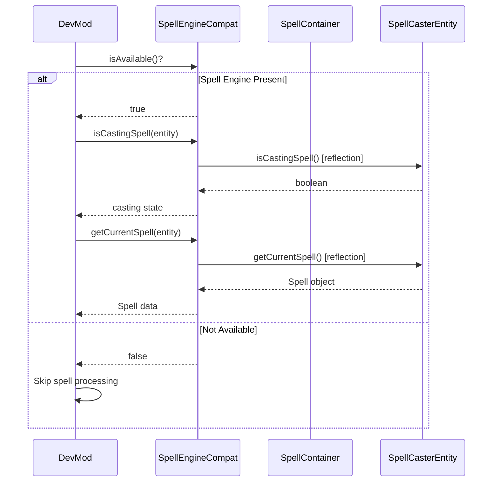

# Spell Engine Integration

## 1. Mod Overview

| Property | Value |
|----------|-------|
| **Mod Name** | Spell Engine |
| **Mod ID** | `spell_engine` |
| **Version Detected** | 1.8.11+1.21.1 |
| **Minecraft Version** | 1.21.1 |
| **Loader** | NeoForge |
| **Repository** | [GitHub - ZsoltMolnarrr/SpellEngine](https://github.com/ZsoltMolnarrr/SpellEngine) |
| **CurseForge** | [Spell Engine](https://www.curseforge.com/minecraft/mc-mods/spell-engine) |
| **Modrinth** | [Spell Engine](https://modrinth.com/mod/spell-engine) |

## 2. Compatibility Goals

### Problems Solved
- Data-driven spell definitions (JSON-based)
- SpellContainer system for item-bound spells
- Trigger system with 14+ types (melee, arrow, spell, damage, etc.)
- Multiple targeting modes (Aim, Beam, Area, Caster, etc.)
- Equipment set bonuses with spell grants

### Improvements for DevMod
- Detect spell casting state for telemetry
- Read spell container data from items
- Track spell-based damage in combat analytics
- Display spell info in entity overlays
- Support spell items in the item editor

## 3. Detection & Gating

### Detection Method
```java
// Using DevMod's Compat utility
boolean isLoaded = Compat.isLoaded("spell_engine");

// Check compat availability
boolean available = SpellEngineCompat.isAvailable();
```

### Avoiding Classloading Issues
- All Spell Engine API classes accessed via **reflection only**
- No direct imports of `net.spell_engine.*`
- Cached Method/Class references for performance
- Safe fallback when Spell Engine is not present

### Gating Pattern
```java
if (SpellEngineCompat.isAvailable()) {
    if (SpellEngineCompat.isCastingSpell(entity)) {
        Object spell = SpellEngineCompat.getCurrentSpell(entity);
        String spellId = SpellEngineCompat.getSpellId(spell);
        // Track spell usage in telemetry
    }
} else {
    // Spell Engine not present - skip spell checks
}
```

## 4. Integration Design

### API Used
- `net.spell_engine.api.spell.SpellContainer` - Spell storage on items
- `net.spell_engine.entity.SpellCasterEntity` - Entity casting interface
- `net.spell_engine.api.spell.SpellHelper` - Utility methods
- `net.spell_engine.api.spell.Spell` - Spell definition class

### Targeting Modes
| Constant | Mode | Description |
|----------|------|-------------|
| `TARGET_AIM` | Aim | Direct target at crosshair |
| `TARGET_BEAM` | Beam | Line-based targeting |
| `TARGET_AREA` | Area | AOE around point |
| `TARGET_CASTER` | Caster | Self-targeted |
| `TARGET_NONE` | None | No targeting required |

### Flow Diagram



## 5. Implemented Changes

### Files Modified
| File | Change |
|------|--------|
| `ModIntegrationManager.java` | Added SpellEngineCompat registration |
| `Compat.java` | Added `SPELL_ENGINE` constant |

### New Files Created
| File | Purpose |
|------|---------|
| `com.devmod.compat.mods.spellengine.SpellEngineCompat` | Main compat module |

### SpellEngineCompat Features
- `isAvailable()` - Check if Spell Engine is loaded
- `getSpellContainer(ItemStack)` - Get spell container from item
- `getSpellIds(container)` - List spells in container
- `getMaxSpells(container)` - Max capacity of container
- `isCastingSpell(entity)` - Check if entity is casting
- `getCurrentSpell(entity)` - Get spell being cast
- `getSpellId(spell)` - Get spell identifier
- `hasSpells(ItemStack)` - Check if item has spells
- `getCastingStatusString(entity)` - Formatted status string

## 6. New Features When Present

| Feature | Description |
|---------|-------------|
| **Casting Detection** | Detect when entities are casting spells |
| **Spell Telemetry** | Track spell usage in combat analytics |
| **Item Editor Support** | Recognize spell containers in editor |
| **HUD Display** | Show casting status in entity overlays |
| **Damage Attribution** | Attribute spell damage correctly |

### Usage Examples

```java
// In combat telemetry
if (SpellEngineCompat.isAvailable()) {
    if (SpellEngineCompat.isCastingSpell(player)) {
        String spellId = SpellEngineCompat.getSpellId(
            SpellEngineCompat.getCurrentSpell(player)
        );
        telemetry.recordSpellCast(player, spellId);
    }
}

// In HUD overlay
if (SpellEngineCompat.isAvailable()) {
    String status = SpellEngineCompat.getCastingStatusString(entity);
    if (!status.isEmpty()) {
        renderText(status); // "Casting: fireball"
    }
}

// Check item for spells
if (SpellEngineCompat.hasSpells(heldItem)) {
    // Item is a spell container
}
```

## 7. Risks & Edge Cases

| Risk | Mitigation |
|------|------------|
| API changes between versions | Version check + reflection fallback |
| Component system access (1.21+) | Placeholder for future implementation |
| SpellCasterEntity not on all entities | instanceof check before casting |
| Null spell during cast transition | Null safety in all methods |

### Known Limitations
- SpellContainer access via components is not yet fully implemented
- Only detects casting state, not cooldowns
- Cannot modify spells (read-only integration)
- Advanced targeting modes not exposed

## 8. How to Test

### Manual Testing Steps
1. Launch game with Spell Engine installed (requires SpellPower, PlayerAnimator)
2. Check logs for: `[Compat:spell_engine] Spell Engine detected and available`
3. Equip a spell book or wand
4. Cast a spell
5. Verify casting state is detected
6. Check telemetry/overlay displays spell info

### Without Spell Engine
1. Remove Spell Engine from mods folder
2. Launch game
3. Check logs for: `[Compat:spell_engine] Spell Engine classes not found`
4. Verify no crashes or errors
5. Verify DevMod works without spell features

### Expected Log Output
```
[Compat:spell_engine] Spell Engine detected and available
[Compat:spell_engine] Version: 1.8.11+1.21.1
[Compat:spell_engine] Client initialization complete
```

### Smoke Test
```java
@Test
void spellEngineCompat_detectsPresence() {
    boolean expected = ModList.get().isLoaded("spell_engine");
    assertEquals(expected, SpellEngineCompat.isAvailable());
}

@Test
void spellEngineCompat_safeWhenNotCasting() {
    if (SpellEngineCompat.isAvailable()) {
        // Should not crash when entity is not casting
        assertFalse(SpellEngineCompat.isCastingSpell(nonCastingEntity));
        assertNull(SpellEngineCompat.getCurrentSpell(nonCastingEntity));
    }
}
```

## 9. Related Mods

Spell Engine is part of the ZsoltMolnarrr RPG ecosystem:

| Mod | Relationship |
|-----|--------------|
| **Spell Power** | Required - provides spell power attributes |
| **Player Animator** | Required - spell casting animations |
| **Wizards** | Uses Spell Engine for wizard spells |
| **Paladins** | Uses Spell Engine for paladin abilities |
| **Archers** | Uses Spell Engine for special arrows |

## 10. Changelog

| Date | Commit | Changes |
|------|--------|---------|
| 2024-12-24 | Initial | Created SpellEngineCompat module |
| | | Added casting state detection |
| | | Added spell container support (partial) |
| | | Documented targeting modes |
