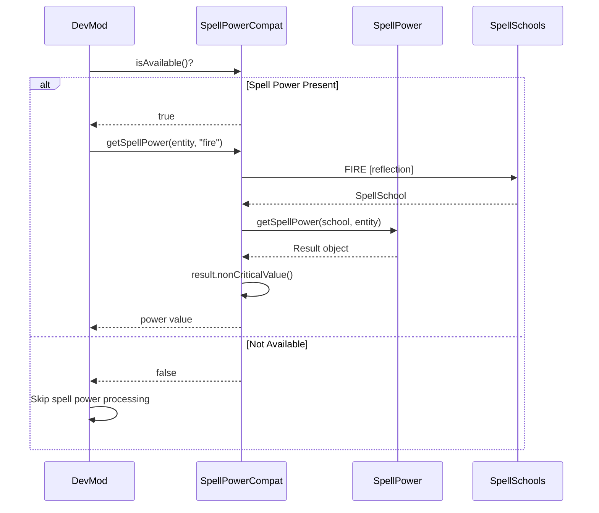

# Spell Power Integration

## 1. Mod Overview

| Property | Value |
|----------|-------|
| **Mod Name** | Spell Power |
| **Mod ID** | `spell_power` |
| **Version Detected** | 1.4.3+1.21.1 |
| **Minecraft Version** | 1.21.1 |
| **Loader** | NeoForge |
| **Repository** | [GitHub - ZsoltMolnarrr/SpellPower](https://github.com/ZsoltMolnarrr/SpellPower) |
| **Modrinth** | [Spell Power](https://modrinth.com/mod/spell-power) |

## 2. Compatibility Goals

### Problems Solved
- Provides spell school attributes (Arcane, Fire, Frost, Healing, Lightning, Soul)
- Secondary attributes (Critical Chance, Critical Damage, Haste)
- Spell power calculation API with crit support
- Magical resistance and vulnerability systems
- Enchantments and status effects for spell stats

### Improvements for DevMod
- Query spell power values for damage calculations
- Display magic stats in entity info overlays
- Include spell attributes in telemetry
- Support spell power items in the item editor
- Identify magic-specialized entities

## 3. Detection & Gating

### Detection Method
```java
// Using DevMod's Compat utility
boolean isLoaded = Compat.isLoaded("spell_power");

// Check compat availability
boolean available = SpellPowerCompat.isAvailable();
```

### Avoiding Classloading Issues
- All Spell Power API classes accessed via **reflection only**
- No direct imports of `net.spell_power.*`
- Cached Method/Class references for performance
- Safe fallback when Spell Power is not present

### Gating Pattern
```java
if (SpellPowerCompat.isAvailable()) {
    double firePower = SpellPowerCompat.getSpellPower(entity, SpellPowerCompat.SCHOOL_FIRE);
    if (firePower > 0) {
        // Entity has fire spell power
    }
} else {
    // Spell Power not present - skip magic calculations
}
```

## 4. Integration Design

### API Used
- `net.spell_power.api.SpellPower` - Main query API
- `net.spell_power.api.SpellSchools` - School constants
- `net.spell_power.api.SpellSchool` - School type interface

### Spell Schools
| Constant | School ID | Color | Description |
|----------|-----------|-------|-------------|
| `SCHOOL_ARCANE` | arcane | Purple | Arcane magic |
| `SCHOOL_FIRE` | fire | Orange | Fire magic |
| `SCHOOL_FROST` | frost | Blue | Frost/Ice magic |
| `SCHOOL_HEALING` | healing | Green | Restorative magic |
| `SCHOOL_LIGHTNING` | lightning | Yellow | Lightning magic |
| `SCHOOL_SOUL` | soul | Cyan | Soul/Spirit magic |

### Flow Diagram



## 5. Implemented Changes

### Files Modified
| File | Change |
|------|--------|
| `ModIntegrationManager.java` | Added SpellPowerCompat registration |

### New Files Created
| File | Purpose |
|------|---------|
| `com.devmod.compat.mods.spellpower.SpellPowerCompat` | Main compat module |

### SpellPowerCompat Features
- `isAvailable()` - Check if Spell Power is loaded
- `getSpellSchool(name)` - Get school object by name
- `getSpellPowerResult(entity, school)` - Get full result object
- `getSpellPower(entity, school)` - Get non-critical value
- `getCriticalSpellPower(entity, school)` - Get crit value
- `getHaste(entity, school)` - Get haste percentage
- `getTotalSpellPower(entity)` - Sum across all schools
- `getStrongestSchool(entity)` - Find dominant school
- `getSpellPowerSummary(entity)` - Formatted status string
- `hasSpellPower(entity)` - Quick presence check

## 6. New Features When Present

| Feature | Description |
|---------|-------------|
| **Magic Stats Display** | Show spell power in entity overlays |
| **Damage Calculation** | Include spell power in magic damage |
| **School Detection** | Identify entity's magic specialization |
| **Telemetry Tracking** | Record spell power in combat analytics |
| **Item Editor** | Recognize spell power equipment |

### Usage Examples

```java
// In damage calculation
if (SpellPowerCompat.isAvailable()) {
    double firePower = SpellPowerCompat.getSpellPower(attacker, SpellPowerCompat.SCHOOL_FIRE);
    if (firePower > 0) {
        damage *= (1 + firePower / 100);
    }
}

// In HUD overlay
if (SpellPowerCompat.isAvailable() && SpellPowerCompat.hasSpellPower(entity)) {
    String summary = SpellPowerCompat.getSpellPowerSummary(entity);
    renderText(summary); // "Fire: 50.0 | Frost: 25.0"
}

// Find dominant magic type
if (SpellPowerCompat.isAvailable()) {
    String school = SpellPowerCompat.getStrongestSchool(entity);
    if (school != null) {
        // Entity specializes in this school
    }
}

// Get casting speed
if (SpellPowerCompat.isAvailable()) {
    double haste = SpellPowerCompat.getHaste(entity, SpellPowerCompat.SCHOOL_FIRE);
    // haste = 100 means normal speed, 150 = 50% faster
}
```

## 7. Risks & Edge Cases

| Risk | Mitigation |
|------|------------|
| API changes between versions | Reflection with fallback |
| School not registered | Return null/safe defaults |
| NaN/Infinity values | Validate before use |
| Performance overhead | Cache school objects |

### Known Limitations
- Cannot modify spell power (read-only)
- Custom schools not automatically detected
- Crit/haste require additional method lookups
- No access to resistance values yet

## 8. How to Test

### Manual Testing Steps
1. Launch game with Spell Power installed
2. Check logs for: `[Compat:spell_power] Spell Power detected and available`
3. Equip spell power gear (wands, staffs, magic armor)
4. Open DevMod entity info overlay
5. Verify spell power values are displayed
6. Cast spells and verify damage reflects spell power

### Without Spell Power
1. Remove Spell Power from mods folder
2. Launch game
3. Check logs for: `[Compat:spell_power] Spell Power classes not found`
4. Verify no crashes or errors
5. Verify DevMod works without spell power features

### Expected Log Output
```
[Compat:spell_power] Spell Power detected and available
[Compat:spell_power] Version: 1.4.3+1.21.1
[Compat:spell_power] Client initialization complete
```

### Smoke Test
```java
@Test
void spellPowerCompat_detectsPresence() {
    boolean expected = ModList.get().isLoaded("spell_power");
    assertEquals(expected, SpellPowerCompat.isAvailable());
}

@Test
void spellPowerCompat_handlesNoSpellPower() {
    if (!SpellPowerCompat.isAvailable()) {
        assertEquals(-1, SpellPowerCompat.getSpellPower(entity, "fire"));
        assertNull(SpellPowerCompat.getStrongestSchool(entity));
    }
}
```

## 9. Related Mods

Spell Power is part of the ZsoltMolnarrr RPG ecosystem:

| Mod | Relationship |
|-----|--------------|
| **Spell Engine** | Uses Spell Power for spell damage |
| **Wizards** | Adds wizard gear with spell power |
| **Paladins** | Adds paladin gear with healing power |
| **Archers** | Some abilities scale with spell power |

## 10. Changelog

| Date | Commit | Changes |
|------|--------|---------|
| 2024-12-24 | Initial | Created SpellPowerCompat module |
| | | Added all 6 spell school support |
| | | Added haste query method |
| | | Added summary/strongest school utilities |
