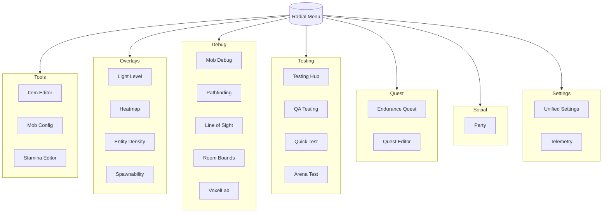
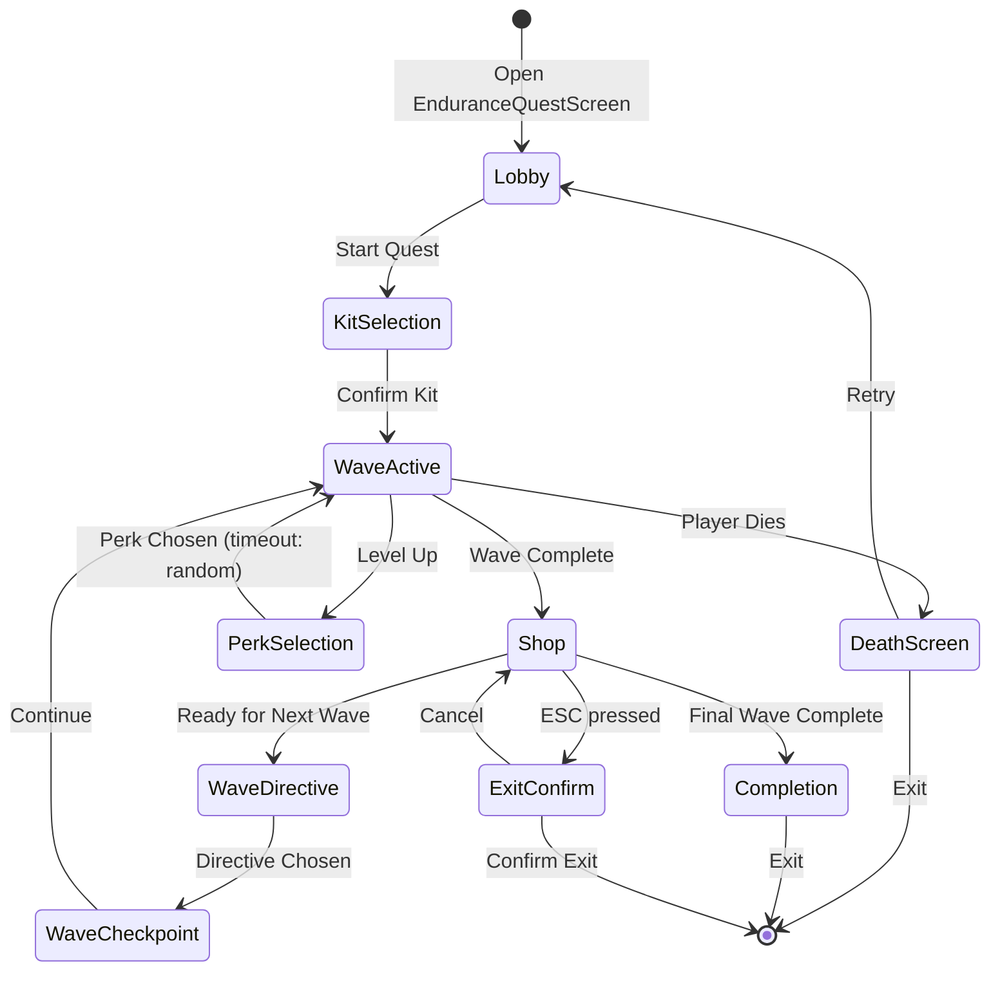

# DevMod UI Navigation Map

> Last updated: 2025-12-26
> Status: HISTORICAL (navigation snapshot)

Nota: mappa di navigazione storica. Confrontare con il codice attuale prima di usarla.

> **Generated**: 2024-12-25 (Updated)
> **Purpose**: Visual flowchart of all UI navigation paths in DevMod

---

## Primary Navigation Flow

```mermaid
flowchart TD
    subgraph Entry["Entry Points"]
        G["G Key<br/>(Radial Menu)"]
        K["K Key<br/>(Settings)"]
        M["M Key<br/>(Editor)"]
        EVENT["Game Events<br/>(Auto-triggered)"]
        NETWORK["Network Packets<br/>(Server-triggered)"]
    end

    subgraph Radial["Radial Menu Hub"]
        RADIAL[("Radial Menu<br/>RadialMenuScreen")]
        RADIAL_DETAIL["Action Detail<br/>RadialActionDetailScreen"]
    end

    subgraph Settings["Settings & Config"]
        UNIFIED["Unified Settings<br/>UnifiedSettingsScreen"]
        GENERAL["General Settings"]
        KEYBINDS["Keybinds Page"]
        TELEMETRY_PAGE["Telemetry Page"]
        EDITOR_SETTINGS["Editor Settings"]
        COMBAT_SETTINGS["Combat Settings"]
        DEBUG_OVERLAYS_PAGE["Debug Overlays"]
        VISUALIZERS["Visualizers"]
        MOB_CONFIG_PAGE["Mob Config Page"]
    end

    subgraph Editors["Editors"]
        ITEM_EDITOR["Item Editor<br/>ItemEditorScreen"]
        MOB_CONFIG["Mob Config<br/>MobConfigScreen"]
        MOB_EQUIP["Mob Equipment<br/>MobEquipmentScreen"]
        STAMINA_EDITOR["Stamina Editor<br/>StaminaSystemEditor"]
        ROOM_BOUNDS["Room Bounds<br/>RoomBoundsEditorScreen"]
    end

    subgraph EditorModals["Editor Overlays"]
        HELP_OVERLAY["Help Overlay"]
        DEBUG_OVERLAY["Debug Overlay"]
        PRESET_SELECTOR["Preset Selector"]
        TEMPLATE_OVERLAY["Template Overlay"]
        ITEM_PICKER["Item Picker"]
        CONFIRM_DIALOG["Confirm Dialog"]
    end

    subgraph Testing["Testing & QA"]
        TESTING_HUB["Testing Hub<br/>TestingHub"]
        QA_TESTING["QA Testing<br/>QATestingScreen"]
        BADGE_TEST["Badge Test<br/>BadgeTestScreen"]
        VOXELLAB["VoxelLab<br/>VoxelLabScreen"]
        VOXELLAB_UI["VoxelLab UI Test"]
        QUICK_WIZARD["Quick Test Wizard"]
        ARENA_WIZARD["Arena Test Wizard"]
    end

    subgraph Endurance["Endurance Quest System"]
        ENDURANCE_MAIN["Endurance Quest<br/>EnduranceQuestScreen"]
        ENDURANCE_SETTINGS["Endurance Settings<br/>EnduranceSettingsScreen"]
        KIT_SELECT["Kit Selection<br/>KitSelectionScreen"]
        ENDURANCE_SHOP["Endurance Shop<br/>EnduranceShopScreen"]
        PERK_SELECT["Perk Selection<br/>PerkSelectionScreen"]
        WAVE_DIRECTIVE["Wave Directive<br/>WaveDirectiveScreen"]
        WAVE_CHECKPOINT["Wave Checkpoint<br/>WaveCheckpointScreen"]
        QUEST_DEATH["Quest Death<br/>QuestDeathScreen"]
        QUEST_COMPLETE["Quest Completion<br/>QuestCompletionScreen"]
        QUEST_EXIT_CONFIRM["Exit Confirm<br/>QuestExitConfirmScreen"]
    end

    subgraph Party["Party System"]
        PARTY_SCREEN["Party Screen<br/>PartyScreen"]
        INVITE_POPUP["Invite Popup<br/>InvitePopupScreen"]
    end

    subgraph Dashboard["Dashboards"]
        TELEMETRY_DASH["Telemetry Dashboard<br/>TelemetryDashboardScreen"]
    end

    subgraph Onboarding["Onboarding"]
        WELCOME["Welcome Screen<br/>WelcomeScreen"]
        WELCOME_TOAST["Welcome Toast<br/>WelcomeToastOverlay"]
        EXTERNAL_CONFIRM["External Link Confirm"]
    end

    %% Entry connections
    G --> RADIAL
    K --> UNIFIED
    M --> ITEM_EDITOR
    EVENT --> WELCOME
    NETWORK --> INVITE_POPUP
    NETWORK --> PERK_SELECT
    NETWORK --> QUEST_DEATH
    NETWORK --> QUEST_COMPLETE

    %% Radial navigation
    RADIAL --> RADIAL_DETAIL
    RADIAL --> UNIFIED
    RADIAL --> ITEM_EDITOR
    RADIAL --> MOB_CONFIG
    RADIAL --> TELEMETRY_DASH
    RADIAL --> TESTING_HUB
    RADIAL --> QA_TESTING
    RADIAL --> ENDURANCE_MAIN
    RADIAL --> PARTY_SCREEN
    RADIAL --> STAMINA_EDITOR
    RADIAL --> ROOM_BOUNDS
    RADIAL --> VOXELLAB
    RADIAL --> ARENA_WIZARD

    %% Settings sub-navigation
    UNIFIED --> GENERAL
    UNIFIED --> KEYBINDS
    UNIFIED --> TELEMETRY_PAGE
    UNIFIED --> EDITOR_SETTINGS
    UNIFIED --> COMBAT_SETTINGS
    UNIFIED --> DEBUG_OVERLAYS_PAGE
    UNIFIED --> VISUALIZERS
    UNIFIED --> MOB_CONFIG_PAGE

    %% Editor navigation
    ITEM_EDITOR --> HELP_OVERLAY
    ITEM_EDITOR --> DEBUG_OVERLAY
    ITEM_EDITOR --> PRESET_SELECTOR
    ITEM_EDITOR --> TEMPLATE_OVERLAY
    ITEM_EDITOR --> ITEM_PICKER
    ITEM_EDITOR --> CONFIRM_DIALOG
    MOB_CONFIG --> MOB_EQUIP

    %% Testing navigation
    TESTING_HUB --> QA_TESTING
    TESTING_HUB --> BADGE_TEST
    TESTING_HUB --> QUICK_WIZARD
    VOXELLAB --> VOXELLAB_UI

    %% Endurance flow
    ENDURANCE_MAIN --> ENDURANCE_SETTINGS
    ENDURANCE_MAIN --> KIT_SELECT
    KIT_SELECT --> |"Quest Started"| ENDURANCE_SHOP
    ENDURANCE_SHOP --> PERK_SELECT
    PERK_SELECT --> |"Wave End"| WAVE_DIRECTIVE
    WAVE_DIRECTIVE --> WAVE_CHECKPOINT
    WAVE_CHECKPOINT --> ENDURANCE_SHOP
    ENDURANCE_SHOP --> |"Player Death"| QUEST_DEATH
    QUEST_DEATH --> |"Retry"| ENDURANCE_MAIN
    QUEST_DEATH --> |"Exit"| RADIAL
    ENDURANCE_SHOP --> |"Victory"| QUEST_COMPLETE
    QUEST_COMPLETE --> RADIAL
    ENDURANCE_SHOP --> |"ESC"| QUEST_EXIT_CONFIRM
    QUEST_EXIT_CONFIRM --> |"Confirm"| RADIAL
    QUEST_EXIT_CONFIRM --> |"Cancel"| ENDURANCE_SHOP

    %% Party flow
    PARTY_SCREEN --> INVITE_POPUP
    INVITE_POPUP --> |"Accept"| PARTY_SCREEN
    INVITE_POPUP --> |"Decline"| PARTY_SCREEN

    %% Onboarding
    EVENT --> |"Screen blocked"| WELCOME_TOAST
    WELCOME --> RADIAL
    WELCOME --> EXTERNAL_CONFIRM
    EXTERNAL_CONFIRM --> WELCOME
    WELCOME_TOAST --> |"ESC or timeout"| GAME

    %% Back to game
    RADIAL --> |"ESC"| GAME["Return to Game"]
    UNIFIED --> |"ESC"| GAME
    ITEM_EDITOR --> |"ESC"| GAME
```

---

## HUD Overlay Activation Map

```mermaid
flowchart LR
    subgraph Triggers["Triggers"]
        CONFIG["Config Toggles"]
        KEYBIND["Keybind Press"]
        GAME_STATE["Game State"]
        NETWORK_EVENT["Network Event"]
    end

    subgraph AlwaysActive["Always Active (Config-Gated)"]
        MOB_STATS["Mob Stats Layer"]
        QA_NOTIF["QA Notifications"]
    end

    subgraph ToggleOverlays["Toggle Overlays"]
        LIGHT["Light Level"]
        ENTITY_DENSITY["Entity Density"]
        SPAWNABILITY["Spawnability"]
        ATTRIBUTE_HUD["Attribute HUD"]
        SKILL_EFFICACY["Skill Efficacy"]
        ECONOMY["Economy"]
        QUEST_HUD["Quest HUD"]
        FPS["FPS Tracker"]
        HELP["Quick Help"]
    end

    subgraph StateOverlays["State-Triggered Overlays"]
        ENDURANCE_HUD["Endurance Quest HUD"]
        PARTY_HUD["Party HUD"]
        STAMINA_HUD["Stamina HUD"]
        BOSS_PHASE["Boss Phase"]
        COMBAT_PANEL["Combat Panel"]
        IMPACT_HUD["Impact HUD"]
        RESONANCE["Resonance HUD"]
        CONTRACT["Contract HUD"]
    end

    subgraph EventOverlays["Event-Triggered Overlays"]
        TOKEN_GAIN["Token Gain"]
        BADGE_POPUP["Badge Popup"]
        RECORD_BANNER["Record Banner"]
        HEADSHOT_FLASH["Headshot Flash"]
        COMBO_DECAY["Combo Decay"]
        QUEST_SEQ["Quest Sequence"]
        INSTANCE_LOAD["Instance Loading"]
        ONBOARDING["Onboarding Tips"]
        WELCOME_TOAST_HUD["Welcome Toast"]
    end

    subgraph TestingOverlays["Testing Overlays"]
        ACTIVE_TEST["Active Test HUD"]
        INTEGRATED_TEST["Integrated Test"]
        ARENA_DEBUG["Arena Debug"]
        BUILD_PROGRESS["Build Progress"]
        TELEMETRY_STATUS["Telemetry Status"]
    end

    CONFIG --> MOB_STATS
    CONFIG --> QA_NOTIF

    KEYBIND --> LIGHT
    KEYBIND --> ENTITY_DENSITY
    KEYBIND --> SPAWNABILITY
    KEYBIND --> ATTRIBUTE_HUD
    KEYBIND --> SKILL_EFFICACY
    KEYBIND --> ECONOMY
    KEYBIND --> QUEST_HUD
    KEYBIND --> FPS
    KEYBIND --> HELP

    GAME_STATE --> ENDURANCE_HUD
    GAME_STATE --> PARTY_HUD
    GAME_STATE --> STAMINA_HUD
    GAME_STATE --> BOSS_PHASE
    GAME_STATE --> COMBAT_PANEL
    GAME_STATE --> IMPACT_HUD

    NETWORK_EVENT --> RESONANCE
    NETWORK_EVENT --> CONTRACT
    NETWORK_EVENT --> TOKEN_GAIN
    NETWORK_EVENT --> BADGE_POPUP
    NETWORK_EVENT --> RECORD_BANNER
    NETWORK_EVENT --> COMBO_DECAY
    NETWORK_EVENT --> QUEST_SEQ
    NETWORK_EVENT --> INSTANCE_LOAD

    GAME_STATE --> ONBOARDING
    GAME_STATE --> HEADSHOT_FLASH
    GAME_STATE --> WELCOME_TOAST_HUD

    GAME_STATE --> ACTIVE_TEST
    GAME_STATE --> INTEGRATED_TEST
    GAME_STATE --> ARENA_DEBUG
    GAME_STATE --> BUILD_PROGRESS
    CONFIG --> TELEMETRY_STATUS
```

---

## Radial Menu Categories

---

## Endurance Quest State Machine

---

## Navigation Depth Analysis

| Max Depth | Path Example |
| --------- | ------------ |
| 1 | G -> Radial Menu |
| 2 | G -> Radial -> Item Editor |
| 3 | G -> Radial -> Settings -> Keybinds |
| 4 | G -> Radial -> Testing Hub -> QA Testing -> Badge Test |
| 5 | G -> Radial -> Endurance -> Kit -> Shop -> Perk Selection |
| 6 | Endurance -> Kit -> Shop -> Directive -> Checkpoint -> Shop -> Completion |

**Recommendation**: Maximum navigation depth of 6 is acceptable for complex game modes like Endurance Quest. Most common paths are 2-3 clicks deep.

---

## Quick Reference: Entry Points

| Key | Opens | Notes |
| --- | ----- | ----- |
| G | Radial Menu | Primary entry - accesses everything |
| K | Settings | Direct (if bound) |
| M | Item Editor | Direct (if bound) |
| ESC | Close current / Exit confirm | Context-dependent |
| F1 | Quick Help Overlay | Toggle |

---

## Network-Triggered UI

The following screens are opened by server-to-client network packets:

| Packet | Opens | Condition |
| ------ | ----- | --------- |
| PerkChoicesPayload | PerkSelectionScreen | During Endurance |
| QuestDeathPayload | QuestDeathScreen | Player death in quest |
| QuestCompletionPayload | QuestCompletionScreen | Quest victory |
| WaveDirectivePayload | WaveDirectiveScreen | Between waves |
| PartyNotificationPayload | InvitePopupScreen | Party invite received |
| QuestSequencePayload | WaveCheckpointScreen | Checkpoint reached |
